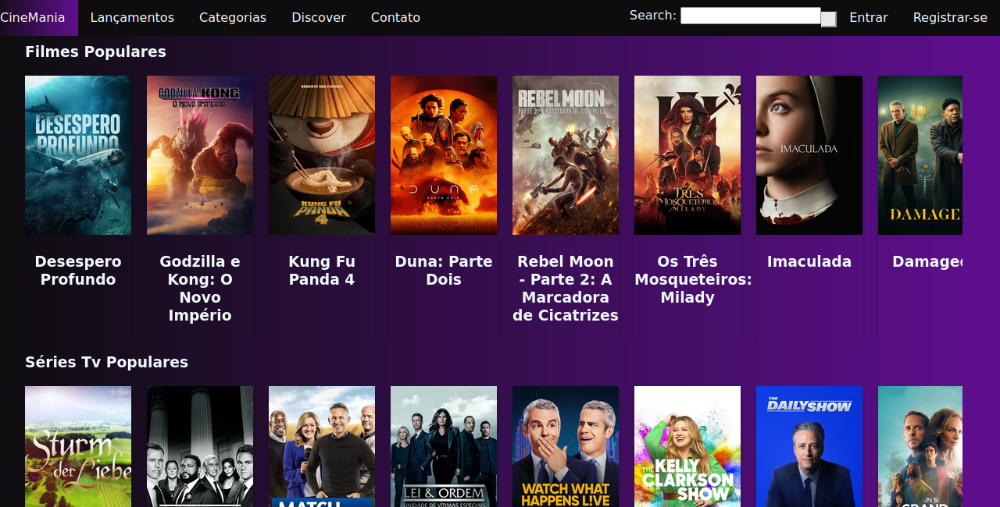
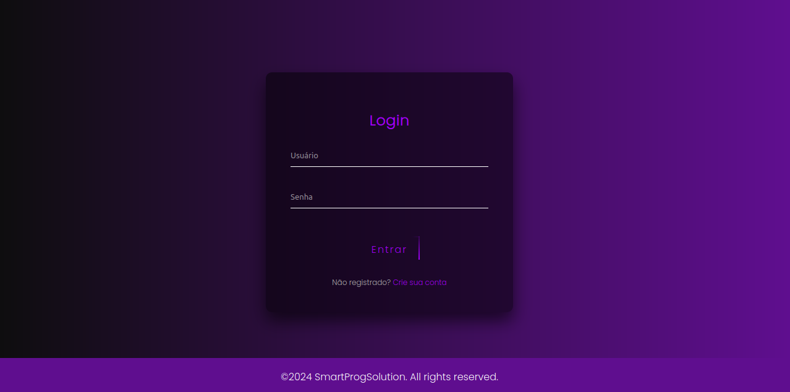
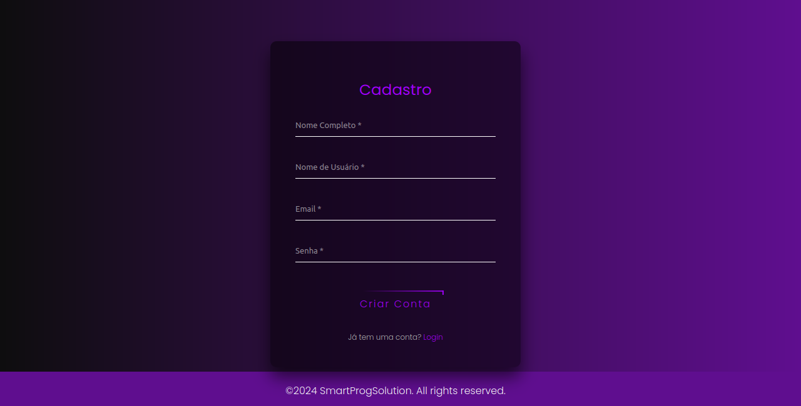
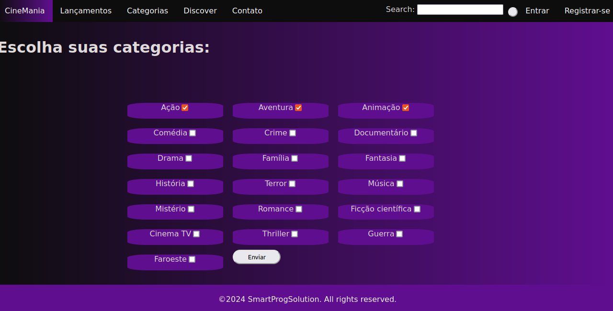
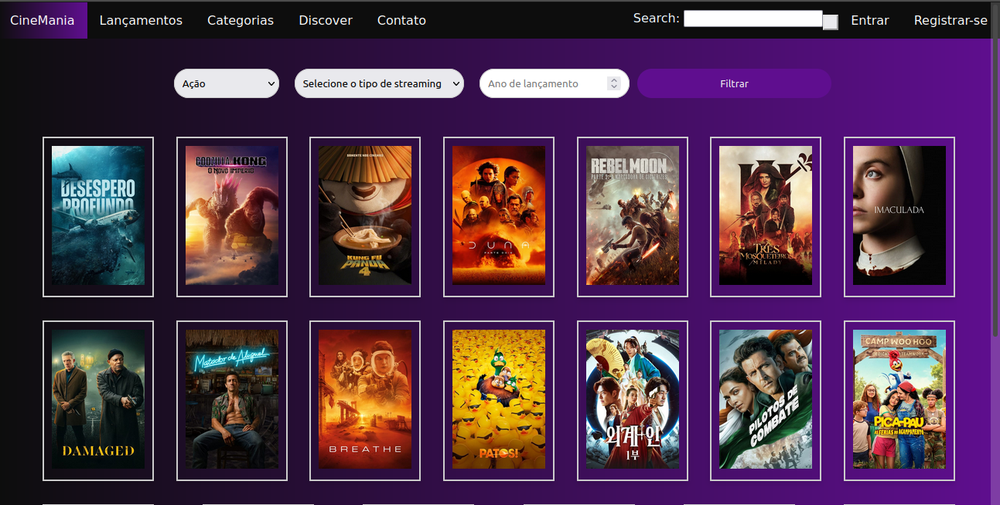
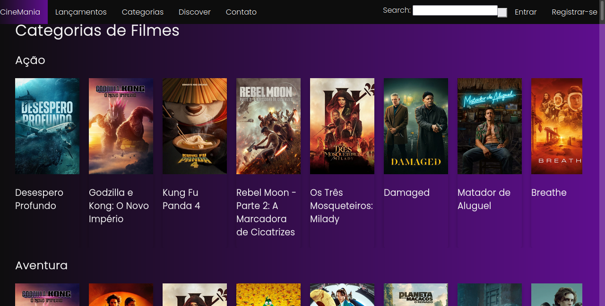
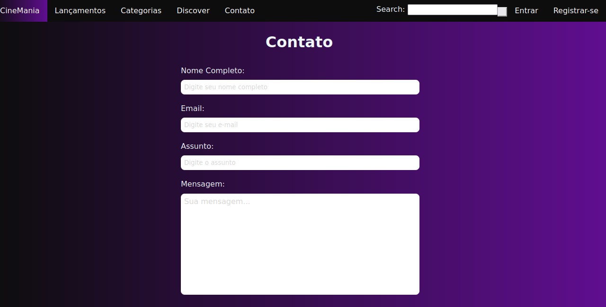
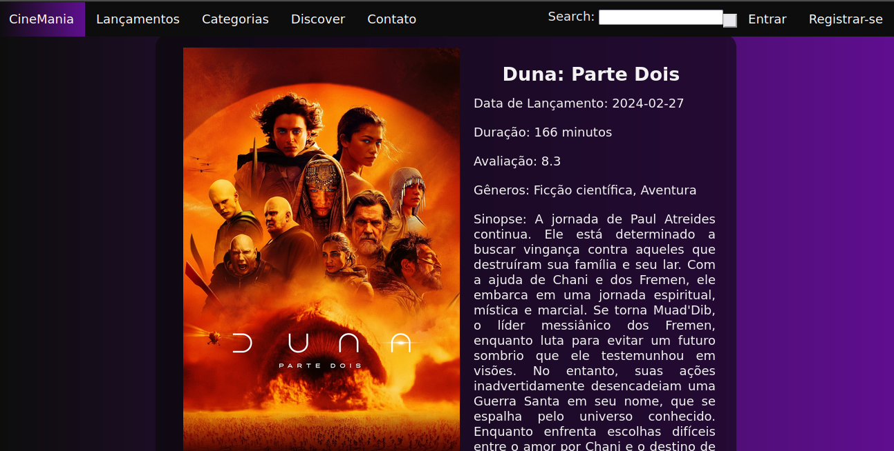
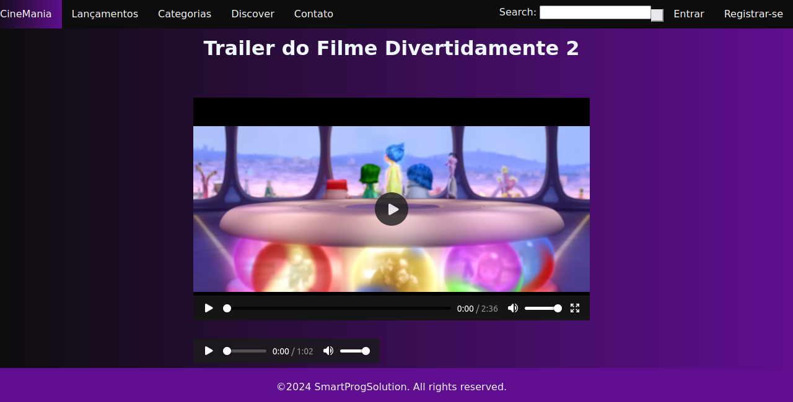
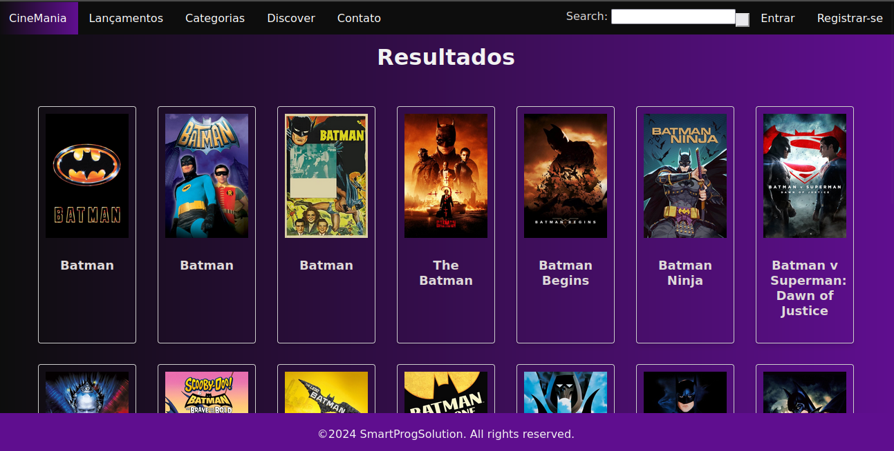

  

  &#xa0;

  <a href="https://smartprogsolutions.github.io/CineMania/">Demo</a>

<h1 align="center">CineMania</h1>

   
  

  

  

  

  

  

  <a href="#-sobre">Sobre</a> &#xa0; | &#xa0;
  <a href="#telas-da-aplicação">Telas</a> &#xa0; | &#xa0;
  <a href="#skateboard-funcionalidades">Funcionalidades</a> &#xa0; | &#xa0;
  <a href="#rocket-tecnologias">Tecnologias</a> &#xa0; | &#xa0;
  <a href="#white_check_mark-requisitos-para-rodar-a-aplicação">Requisitos</a> &#xa0; | &#xa0;
  <a href="#checkered_flag-iniciando">Iniciando</a> &#xa0; | &#xa0;
  <a href="#-configurações-adicionais-ao-projeto">Schemas</a> &#xa0; | &#xa0;
  <a href="#memo-licença">Licença</a> &#xa0; | &#xa0;
  <a href="https://github.com/SmartProgSolutions/CineMania" target="_blank">Autor</a>

 

## Requisitos Mínimos ##

:white_check_mark: Minimo 8 páginas \
:white_check_mark: Navegação entre páginas \
:white_check_mark: Minimo 3 imagens \
:white_check_mark: 1 áudio \
:white_check_mark: 1 vídeo \
:white_check_mark: Estilização CSS\
:white_check_mark: Minimo 1 Formulário\
:white_check_mark: estrutura básica HTML <header> <section> <footer>\
:white_check_mark: Minimo 3 eventos DOM\

## Visão Geral ##

O CineMania é uma aplicação web que oferece aos usuários um vasto catálogo de filmes, buscando proporcionar uma experiência completa e intuitiva para a navegação e pesquisa de obras cinematográficas. A plataforma foi desenvolvida utilizando tecnologias modernas e segue os princípios de acessibilidade e design responsivo, garantindo uma experiência agradável em diferentes dispositivos. usamos conceitos de Abstração de POO, para reutilização de código, 

## Telas da aplicação

### 1-Login ##

### 2-Register ##

## 3-Preferências ##

## 4-Home ##

## 5-Discover ##

## 6-Categorias ##

## 7-Contato ##

## 8-Detalhes do Movie ##

## 9-Lançamentos ##

## 10- Resultados da pesquisa ##

## 10- Resultados da pesquisa ##

## :skateboard: Funcionalidades ##

:heavy_check_mark: Catálogo Extenso: Acesse um vasto acervo de filmes provenientes da API The Movie Database (https://www.themoviedb.org/), com opções para filtrar e encontrar o filme perfeito para você

:heavy_check_mark: Navegação por Categorias: Explore filmes por diferentes categorias, como gêneros, popularidade e lançamentos recentes.

:heavy_check_mark: Página Detalhada do Filme: Obtenha informações completas sobre cada filme, incluindo título, ano de lançamento, sinopse, classificação e trailer (quando disponível).

:heavy_check_mark: Busca Personalizada: Utilize a barra de busca para encontrar filmes por título, gênero, diretor ou palavras-chave.

:heavy_check_mark: Página de Login e Cadastro: Crie uma conta para salvar suas preferências e acompanhar seus filmes favoritos.

:heavy_check_mark: Página de Contato: Entre em contato com a equipe do CineMania para enviar sugestões ou relatar problemas.

:heavy_check_mark: Design Responsivo: Acesse o CineMania de qualquer dispositivo, seja ele um computador, tablet ou smartphone, com a interface se adaptando perfeitamente à tela.

:heavy_check_mark: Desempenho Otimizado: Navegue pelo CineMania com rapidez e fluidez, graças à otimização do código e da estrutura da aplicação.

# Tecnologias Utilizadas :rocket:

- [HTML 5](#)
- [CSS 3](#)
- [Live Server](#)
- [JavaScript](#)
- [API TMDB](https://www.themoviedb.org/)
- [envio de emails com FormSpree](#)

# Equipe de Desenvolvimento

Feito com ❤️ por 

<a href="https://github.com/KevillaAguiar" target="_blank">Kevilla Aguiar🦅</a> 

<a href="https://github.com/WendrilXX" target="_blank">Wendrill Gabriel</a> 

 <a href="https://github.com/AlcivanLucas" target="_blank">Alcivan Lucas</a> 
  
 <a href="https://github.com/Joap-Filho" target="_blank">João Filho</a>
 
 <a href="https://github.com/heitorviana-dev" target="_blank">Heitor Viana</a>
